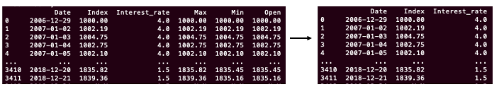

# Charts generator 
#### App generating multilines charts based on various CSV files downloaded from popular stock websites.


## Table of contents:
#### * General info
#### * Technologies 
#### * Setup
#### * Status

## **General info**:
The main goal of this app is **reducing time** spent on generating over 20 charts which I needed to include in **my master's thesis**. 
Because I wanted all charts to be in the same style I decided to write a program that did it for me.

The program is ready to work with:
* files which are .csv 
* user who wants to display on chart **more than one line** and more than one y-axis
* .csv files which have **different lenghts** (number of rows) and number of columns

Only things which user needs to do are uploading of necessary .csv files and changing names of title, axes and labels in main script.
     
## **Technologies**:
Python 3.7.4

### Libraries and packages which have been used:
 - **numpy**
 - **pandas**
 - **matplotlib**
 
 
## **Setup**:
macOS 10.14.6
 
After cloning the repo:
1. Paste do main directory .csv files which contains data like: stock prices, index points, bonds interest rates and so on. _The websites I used were: investing.com and stooq.pl_.
2. Open ```new.py``` script.
3. In ```main()``` function change names for file1.csv and file2.csv to be names of your .csv files.
4. In class ```CombinedData()``` in function ```remove_useless_columns()``` change columns to be removed, it means replace the ```[3,4,5,6]``` with ```[your columns to drop]```.

 

_As you can see on above left image, I have much more columns than I need to display on chart. This is why I dropped them._

5. In class ```Graphs(CombinedData)``` in function ```prepare_lines_for_chart()``` change frequency for ```x_ticks_labels```. If you have a wide range of dates _(I have more than 10 years)_ it would be better to use ```80``` or ```100```. Test some cases and choose the best one.
6. In the same function please change names for title, labels and axes.
7. That's all. The graph will be generated and saved in the folder in which the script ```new.py``` is located.

## **Status**:

The next steps will be:
* preparing script to be able work on .csv files with different date formats

